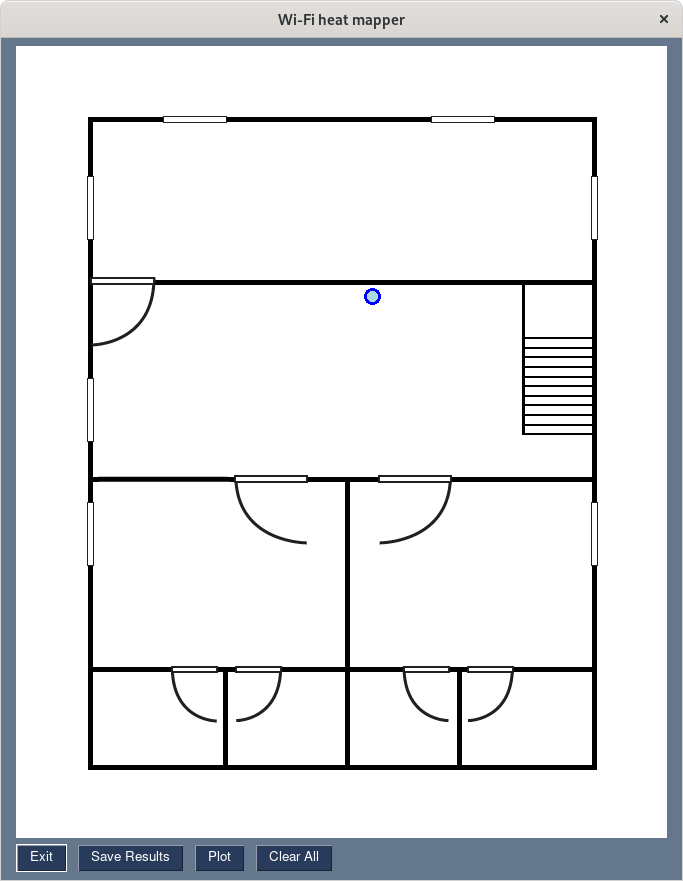

# whm

## whm aka wifi-heat-mapper

whm also known as `wifi-heat-mapper` is a Python library for benchmarking Wi-Fi networks and gather useful metrics that can be converted into meaningful easy-to-understand heatmaps. The tool aims to assist network engineers, admins and homelabbers in figuring out the performance of their Access Points and Routers. While this tool may help in giving a general idea of your WiFi performance, the tool is not meant to be comprehensive.

This tool is heavily inspired by [python-wifi-survey-heatmap](https://github.com/jantman/python-wifi-survey-heatmap) by [Jason Antman](www.jasonantman.com).

## Supported Platform
* Operating System
    - Linux x86_64 (64 bit)

## Dependencies
### Required
* Python version: 3.7 - 3.9 (with Tkinter)
* iperf3 >= 0.1.11
* matplotlib >= 3.4.0
* tqdm >= 4.55.0
* Pillow >= 8.2.0
* scipy >= 1.6.0
* numpy >= 1.20.0
* PySimpleGUI >= 4.34.0

### Optional
* [Ookla Speedtest CLI](https://www.speedtest.net/apps/cli) >= 1.0.0.2 (Recommended)
* [Sivel Speedtest CLI](https://github.com/sivel/speedtest-cli) >= 2.1.3 (Jitter is not available, Not Recommended)
* [Librespeed CLI](https://github.com/librespeed/speedtest-cli) >= 1.0.9 (Strongly Recommended)

### Tkinter Dependency

By default Tkinter is not installed with Python. Users are requested to install Tkinter using their respective package managers.

### Arch Linux and Manjaro
```bash
$ pacman -S tk
```

### Fedora, CentOS, RHEL and RockyLinux
```bash
$ dnf install python3-tkinter
```

### Debian and Ubuntu
```bash
$ apt install python3-tk
```

### openSUSE and SUSE Linux Enterprise
```bash
$ zypper install python3-tk
```

### Gentoo
[Official Wiki instructions](https://wiki.gentoo.org/wiki/Tkinter)

## Installation

The easiest way to install whm is via [pip](https://pip.pypa.io/en/stable/).

```bash
$ pip install whm
```

Alternatively, you can clone the repository and compile it.

```bash
$ git clone https://github.com/Nischay-Pro/wifi-heat-mapper.git
$ cd wifi-heat-mapper
$ python3 setup.py install
```

## Usage

### Server Configuration

whm requires connecting to an `iperf3` instance running in server mode. On a machine which is available in your LAN run `iperf3 -s` to start iperf3 in server mode in foreground. I strongly recommend running the iperf3 instance on a wired computer or virtual machine instance.

By default, iperf3 will use TCP and UDP ports 5201.


### Client Configuration

#### Configuration Bootstrapping

Initially, you need to bootstrap your configuration specifying the graphs you would like to view, the number of times you want to repeat benchmarking, the wireless interface you will be using to profile, and the SSID configured. In case you are using `librespeed-cli` you will be asked if you prefer it over `speedtest` and optionally provide a path to your custom libre server list.

whm supports multiple graphs allowing users to select one, more, or all graphs. The tool will automatically gather the appropriate metrics to generate the graphs.

```bash
$ whm bootstrap
```

> **NOTE:** To profile metrics from Ookla speedtest, the user needs to ensure that they have installed the binary provided by Ookla and is accessible from `$PATH` environment variable.

After completing the process, a file called `config.json` will be available in the directory you have executed the command from.

To specify a save path and file name use the `--config` option, including the path and the filename for storing the configuration details.

For example:

```bash
$ whm bootstrap --config /home/example/whm/test.json
```

#### Benchmarking

Once you have generated the configuration file you can start benchmarking.

```bash
$ whm benchmark -m examples/sample_floor_map.jpg -s 192.168.1.100 -c config.json 
```

Command-line options used:

* `-m` or `--map` is the path to the floop map.
* `-s` or `--server` is the IP address(:port) of the iperf3 server. You can specify a port using `IPADDRESS:PORT`, like `192.168.1.100:5123`. If no port is specified the default port `5201` is used.
* `-c` or `--config` is the path to the configuration file you bootstrapped earlier.

After specifying the appropriate options a GUI window will open up.

You will be presented with a canvas with your floor map loaded.


* Exit: To quit benchmarking
* Save Results: Save the results you have captured till now. Results are stored in the same configuration file you have used earlier.
* Plot: To plot the results you have captured.
* Clean All: Wipes the canvas clean, removing all captured metrics.

#### Gathering metrics

1. Start by Left-clicking on the canvas roughly at a position where you are capturing the metrics from. A gray circle with a blue outline should appear now.


2. Now right-click on the circle. You will be presented with a drop-down menu having 3 options.
    * Benchmark: whm will start capturing metrics at this position.
    * Delete: whm will delete the point and metrics (if any) at this point.
    * Mark / Un-Mark as Station: whm will mark this point as a Base station. Useful if you want to have a heatmap displaying the position of one or more base stations. You would still need to benchmark at this point. The border color will change from black to red, indicating a base station point.


3. Select `Benchmark` and wait for a few seconds (or minutes) depending on the graphs you have requested and the number of times benchmarks are repeated. Once benchmarking is done, the circle's fill color changes from gray to light blue. 
    * Benchmark results are automatically saved when they complete successfully.
    * Alternatively, if you would like to rerun benchmarking, simply select any point using the cursor; the black border becomes blue. You can now right-click and select `Benchmark` to recapture metrics.



4. Now move to a new position you want to benchmark from and select the rough position in the canvas.
5. whm requires at least 4 points to generate plots. I strongly recommend profiling as many points as possible to increase the accuracy of the heatmap.

6. Once completed click on `Save Results` to save the metrics to file. You can then plot your metrics by pressing `Plot`.

#### Resuming from a previous state

To resume from a previous benchmarking state, simply repeat the command you used to run the benchmarking initially. All results are stored in the configuration file the user has specified originally.

#### Plotting

whm also offers the user additional command-line arguments when plotting.

To generate plots with custom flags, you can specify them using the `whm plot` command.

```bash
$ whm plot -m ./examples/sample_floor_map.jpg -c config.json -l 100 -d 300 -f png 
```

Command-line options used:

* `-m` or `--map` is the path to the floop map.
* `-c` or `--config` is the path to the configuration file you bootstrapped earlier.
* `-l` or `--levels` (optional) is the number and positions of the contour lines / regions. Default (100)
* `-d` or `--dpi` (optional) is the resolution of the figure in dots-per-inch. Default (300)
* `-f` or `--format` (optional) is used to specify the export file format for generated plots. Default (png). 
Supported options include (png, pdf, ps, eps, svg)

The directory from which the user has run the command will contain the graphs that the user requested during bootstrap.

## Examples
A sample configuration, including benchmark results and plots generated is provided in the [examples](examples/SAMPLE.md) folder.


## Contributing
Pull requests are welcome. For significant changes, please open an issue first to discuss what you would like to change.

Please make sure to run tests as appropriate.

## License
[GPLv3](https://choosealicense.com/licenses/gpl-3.0/)