# Sample Benchmark

## Configuration Details

* ArchLinux with Linux Kernel 5.12.4-arch1-2, GCC 11.1.0 and Python 3.9.5
* iperf3 3.9 (Client) and iperf3 3.7 (Server)
* Intel Wi-Fi 6 AX200 chipset
* Using Librespeed for speedtest backend.
* Benchmarks were averaged over 3 runs

## General Connectivity

### Signal Quality
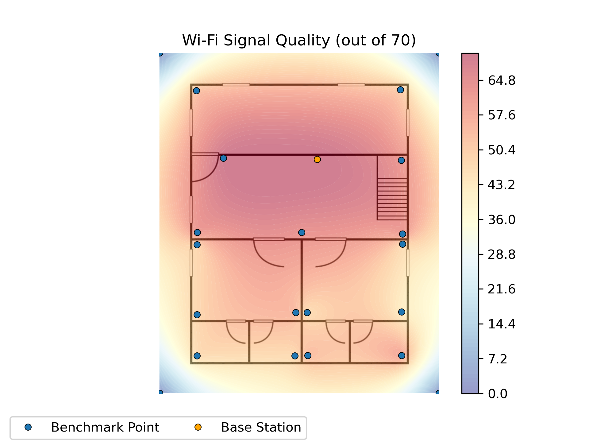

### Signal Quality Percentage
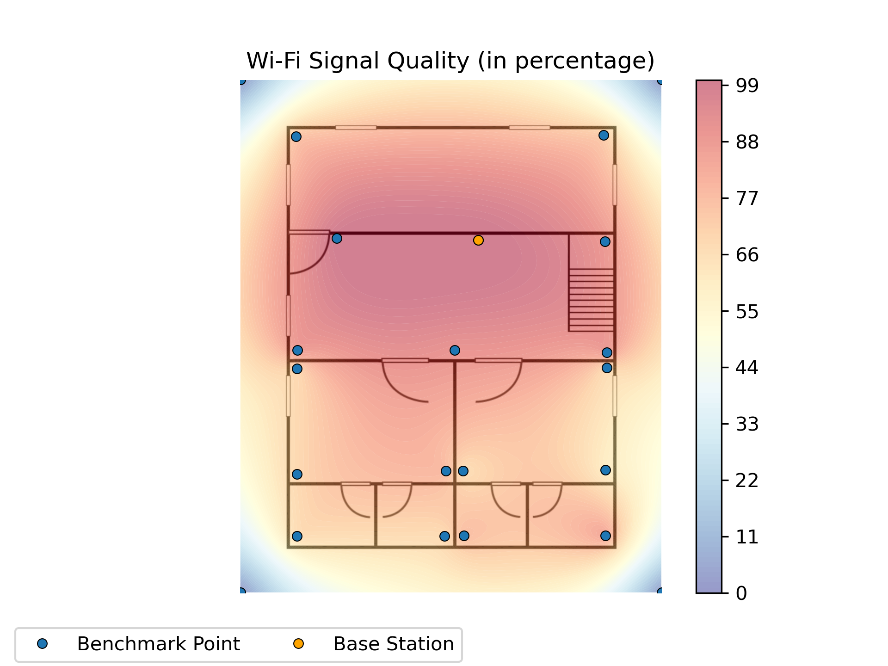

### Signal Strength
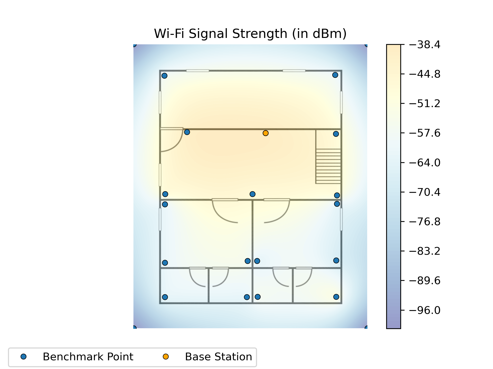

## TCP

### Download in bits/s

### Download in bytes/s
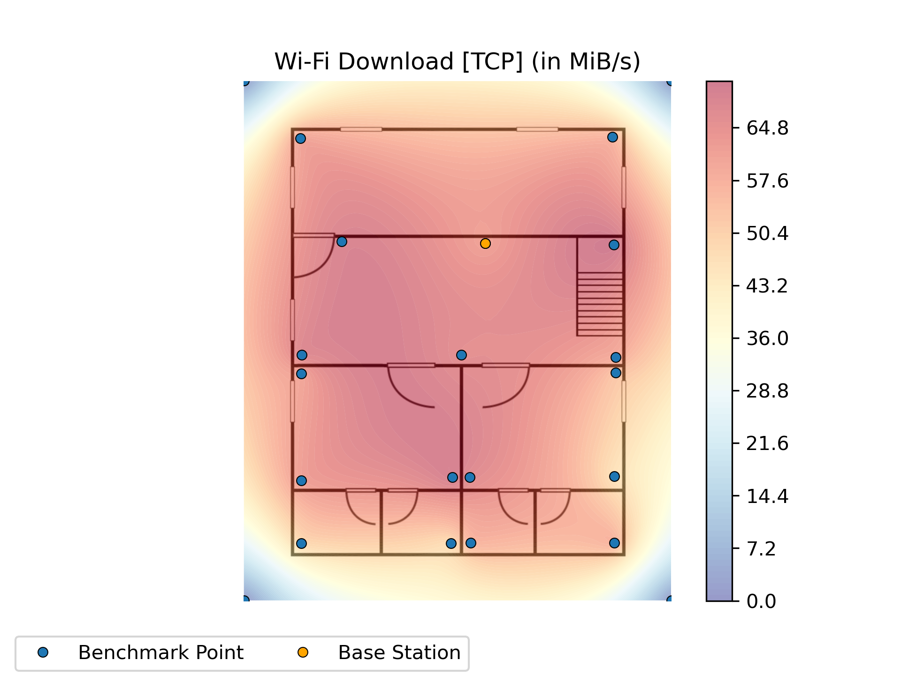

### Upload in bits/s
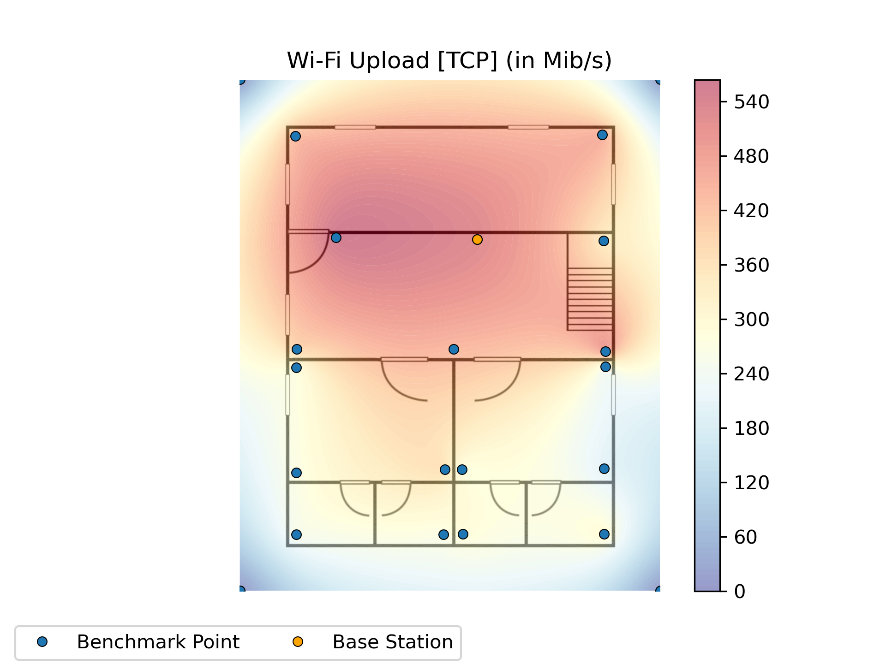

### Upload in bytes/s
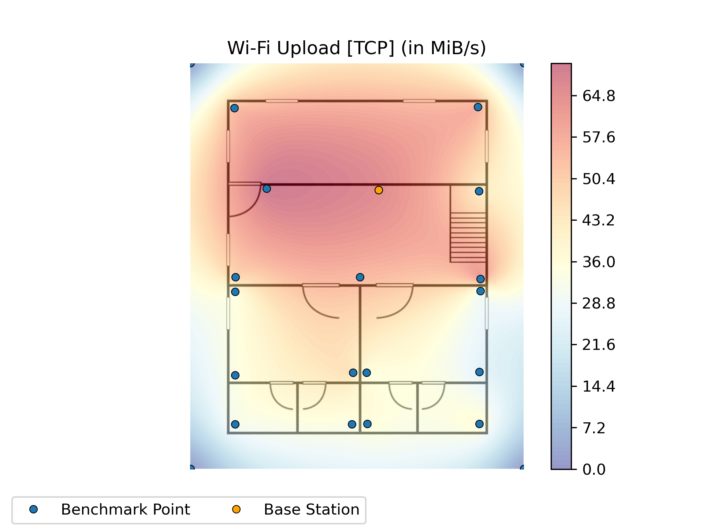

## UDP

### Download in bits/s
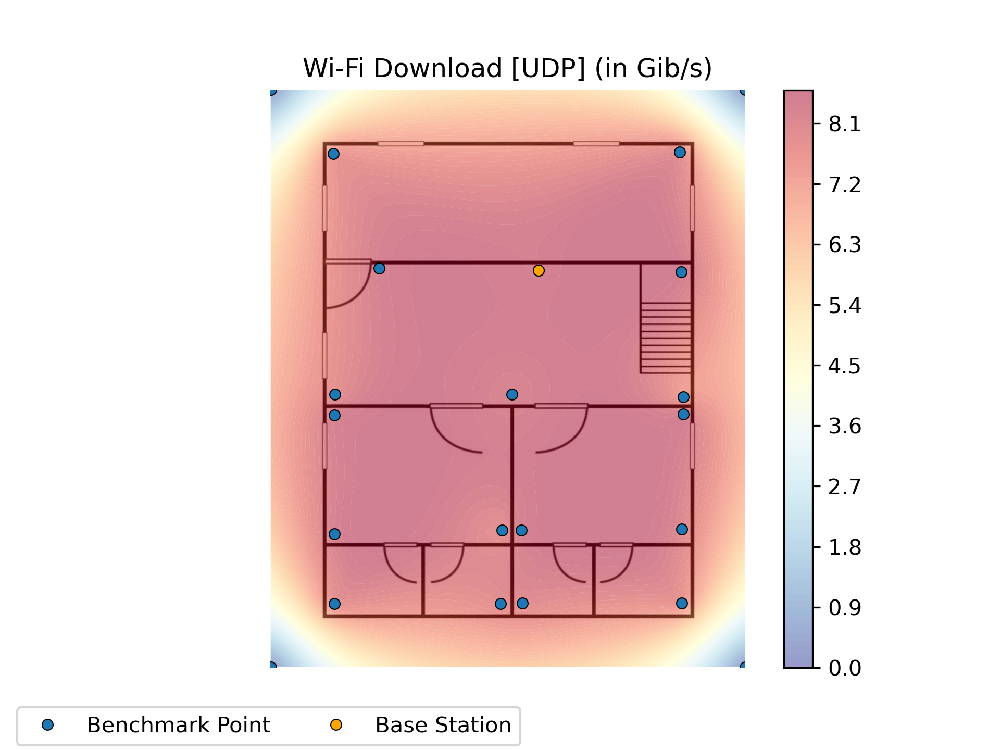

### Download in bytes/s
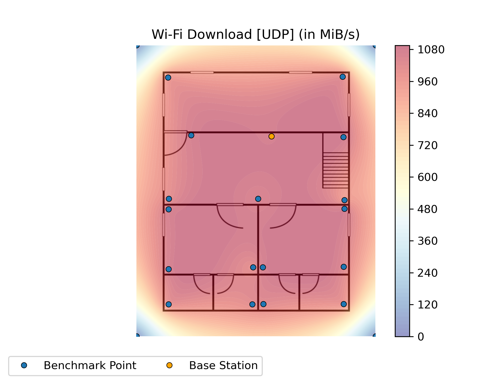

### Upload in bits/s
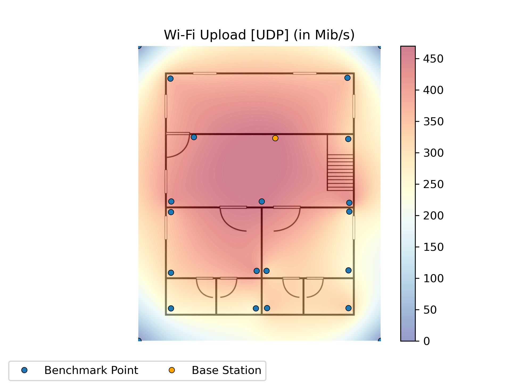

### Upload in bytes/s

### Upload Jitter
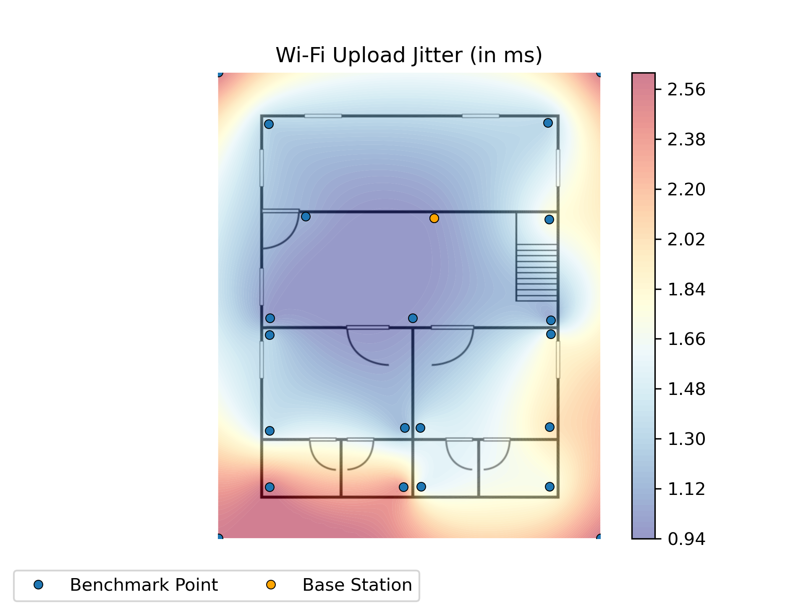

## Speedtest (Librespeed Backend)
### Latency
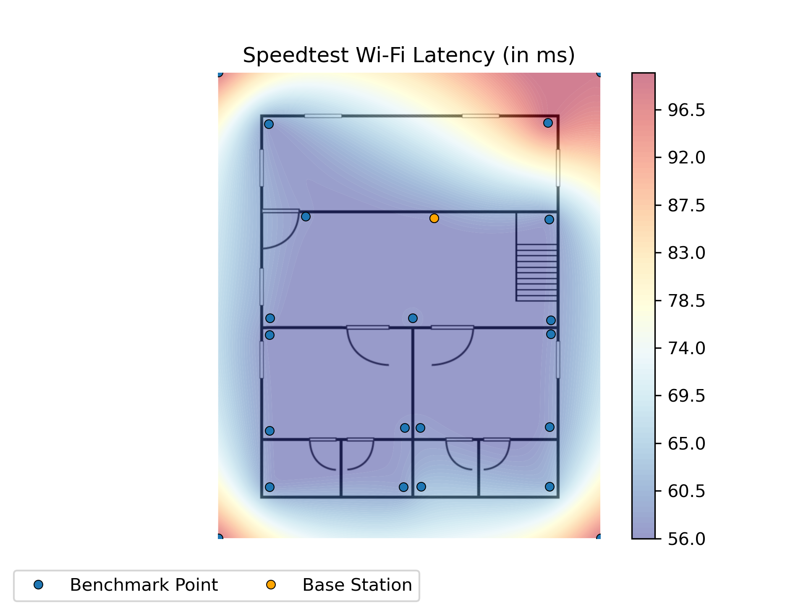

### Jitter
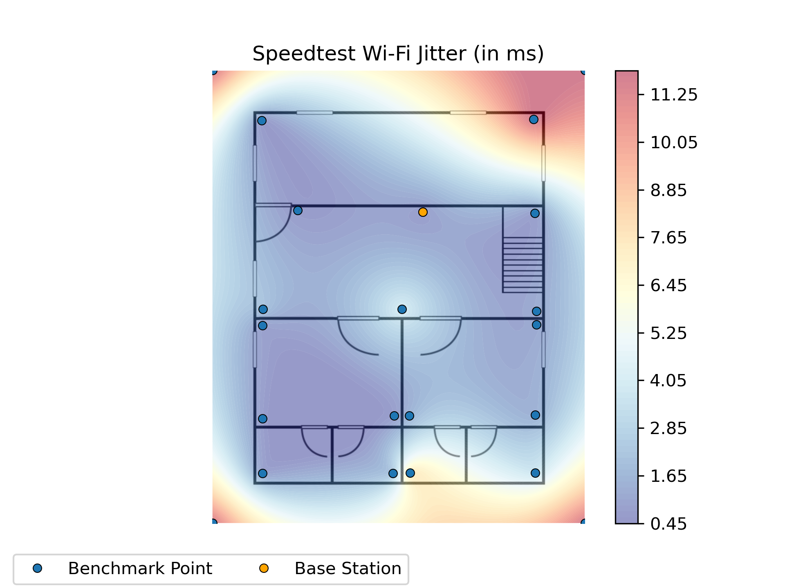

### Download in bytes/s
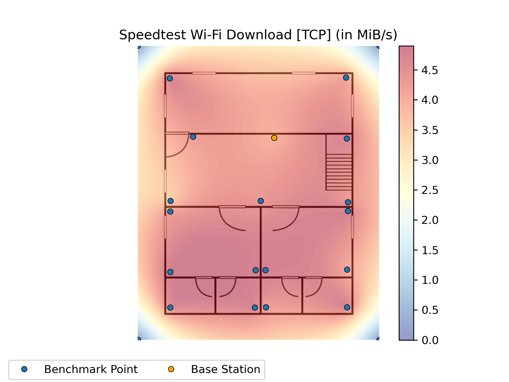

### Upload in bytes/s
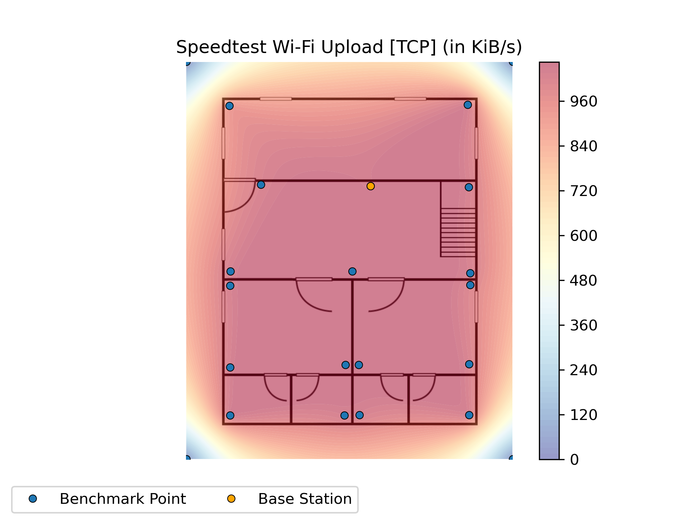